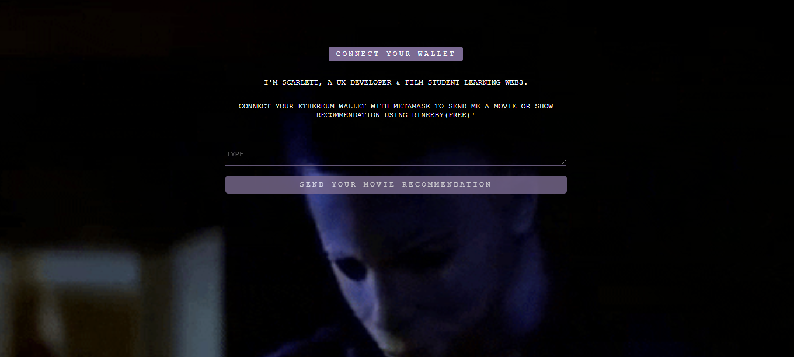
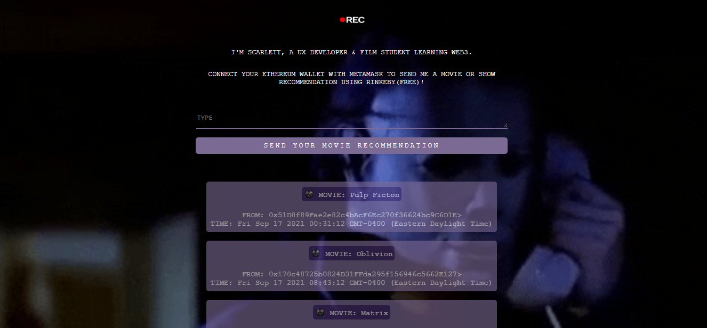

# MOVIE APP

This is a [Buildspace](https://buildspace.so/) project.

During a 2-week learn-a-thon, I wrote an Ethereum smart contract, deployed the smart contract to the blockchain, 
and created a user dApp that interacts with the smart contract; allowing users to send me movie recommendations.
To view the app, visit https://movies.scarlett-spade.repl.co/.
  
# NFT CERTIFICATE

I earned an NFT for being a part of the first 200 people to complete the 2-week sprint.
