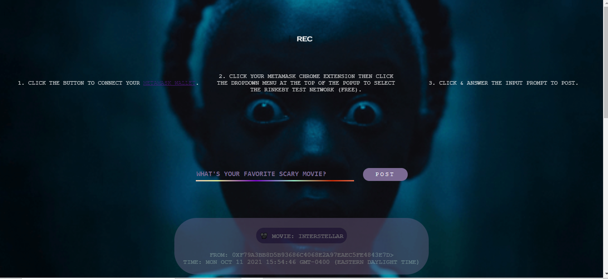

# ETHEREUM WEB APP

This is a [Buildspace](https://buildspace.so/) project.

# ABOUT

I coded and deployed an Ethereum smart contract with an interactive web app using Solidity and React amongst 200+ developers during a two-week sprint.
As a Buildspace learn-a-thon, there was a live "kick-off" showcasing an intro to the project scope. There were scheduled, hour-long coworking sessions
where lo-fi beats played as we indivdually worked alongside the developer community.

# USE CASE

For my project, I created a movie portal. Users can send me prompted movie recommendations on the blockchain by connecting their Metamask wallet to 
the free Rinkeby testnet. Once the user's Metamask wallet is connected to the web app, the movie portal is enabled and movie recommendations from
other users can be seen!

# HELPFUL TERMS
1. __Smart Contract__: a piece of code that lives on the blockchain
2. __Blockchain__: a public place where anyone can securely read and write data for a fee
3. __Metamask Wallet__: a crypto wallet & secure gateway to connect blockchain apps
4. __Rinkeby Testnet__: a free Ethereum test network

# INSTALL REQUIREMENTS

1. Install node/npm
2. Install Hardhat
3. Install Hardhat Dependencies: Waffle & Ethers
4. Install Metamask Browser Extension

# NFT CERTIFICATE

I earned an NFT for being a part of the first 200 developers to complete the 2-week sprint.

